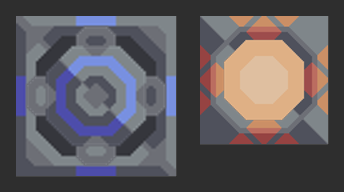

# Водяная скважина, мега-купол и кооп-режим — мод для Mindustry

Мод из четырёх частей:

1. **Водяная скважина** — контентный блок: скважина 5×5 с дизайном ванильного
   гидронасоса Mindustry, растянутым с 2×2, в тёмно-серой окраске. Четыре
   ротора вращаются, блок производит воду на любой поверхности.
2. **Мега-купол** — контентный блок: увеличенный до 4×4 сверхкупол в тёмной
   окраске, разгоняет постройки вокруг на **+400 %** и потребляет воду,
   кремний и титан.
3. **Сборка T5-юнитов вдвое быстрее** — скрипт: юниты пятого уровня
   («Эклипс», «Рейн», «Колларис» и другие) собираются вдвое быстрее.
4. **Кооп-режим для мультиплеера** — скрипт, который меняет правила сетевой
   игры: общая пауза для всех игроков, карта планеты и дерево исследований
   доступны каждому, а «летать» (запускать ядро между секторами) и открывать
   технологии может только хост.

Все спрайты мода — это оригинальные слои Mindustry, увеличенные **плавным
фильтром** (бикубическая интерполяция по premultiplied alpha) вместо
пиксельного удвоения, поэтому линии ровные, без лесенки из квадратов.



*Слева — водяная скважина (5×5, середина — вращающийся ротор), справа —
мега-купол (4×4, купол подсвечен своим цветом свечения). Клетка — 32 пикселя.*

---

# Блоки

## Водяная скважина

| Параметр | Значение |
|---|---|
| Размер | 5×5 клеток, спрайт 160×160 пикселей |
| Выход | до 400 ед. воды в секунду при полном питании |
| Энергия | 3000 ед. мощности в секунду (50 ед. за тик) |
| Буфер | 480 единиц; трубы подключаются с любой стороны |
| Поверхность | любая, в том числе жидкие плитки; месторождение не нужно |
| Анимация | четыре ротора, `rotateSpeed: 1.0`, пока скважина работает |
| Оформление | тёмно-серый корпус (на ~28 % темнее оригинала), синие кольца |

Производительность рассчитана на 60 тиков в секунду: 60 единиц за цикл
длительностью 9 тиков, то есть `60 / 9 × 60 = 400` единиц воды в секунду.

В режиме песочницы блок лежит в категории **«Производство»**, в кампании
появляется в ветке исследований после механического бура.

## Мега-купол

| Параметр | Значение |
|---|---|
| Размер | 4×4 клетки, спрайт 128×128 пикселей |
| Эффект | **+400 %** к скорости всех построек вокруг (они работают в 5 раз быстрее) |
| Радиус | 10 клеток (320 пикселей) |
| Энергия | 2100 ед. мощности в секунду (35 ед. за тик) |
| Вода | 30 ед./с |
| Кремний | 5 ед./с |
| Титан | 2 ед./с |
| Буферы | 80 предметов, 300 единиц жидкости |
| Оформление | дизайн ванильного сверхкупола, растянутый с 3×3 до 4×4 и затемнённый (серый корпус — как у скважины, оранжевое свечение тише на ~20 %) |

Как это считается: ванильный сверхкупол имеет `speedBoost = 2.5` (то есть
+150 %) и радиус 200 пикселей. Здесь `speedBoost = 5`, то есть +400 %, а
`range = 320` — это ровно 10 клеток. Предметы и вода списываются порциями раз в
5 секунд (`useTime = 300`): 25 кремния и 10 титана за раз, 30 воды в секунду.
Если чего-то не хватает, купол не разгоняет постройки — как и ванильный
сверхкупол без ресурсов.

Блок появляется в категории **«Эффекты»** рядом со сверхкуполом; в кампании
открывается в исследованиях после проектора ускорения.

## Как менять блоки

Параметры лежат в `content/blocks/water-well.json` и
`content/blocks/mega-dome.json`, строки интерфейса — в `bundles/`. Имена полей
— ванильные (`size`, `range`, `speedBoost`, `consumes`, `requirements`), так что
менять их можно по документации Mindustry.

---

# Сборка T5-юнитов вдвое быстрее

Юнит пятого уровня — самый сильный в игре. Собираются они очень долго:

| Блок | Юниты | Ванильное время | С модом |
|---|---|---|---|
| Тетративный реконструктор | Эклипс, Токсопид, Рейн, Омура, Окт, Корвус, Наванакс | 240 с | **120 с** |
| Сборщик танков | Конкер | 180 с | **90 с** |
| Сборщик кораблей | Дизрапт | 180 с | **90 с** |
| Сборщик мехов | Колларис | 180 с | **90 с** |
| Сборщик танков | Ванквиш (T4) | 50 с | 50 с — не тронут |
| Экспоненциальный реконструктор | Антумбра и другие (T4) | 65 с | 65 с — не тронут |

Правила такие:

- у **реконструктора** время сборки одно на все апгрейды, поэтому оно
  уменьшается, только если все апгрейды блока ведут к T5 (в ваниле это
  «Тетративный реконструктор»);
- у **«Сборщиков»** время своё у каждого плана, поэтому уменьшаются только
  планы с T5 — планы T4 в тех же блоках остаются как были.

Настройки — в начале `scripts/main.js`:

```js
t5FasterCraft: true,          // выключить — false
t5CraftTimeMultiplier: 0.5,   // 0.5 — вдвое быстрее, 1 — как в ваниле
t5Units: [],                  // свои T5-юниты других модов, например ["my-titan"]
```

Время меняется на объектах блоков, то есть в симуляции. В мультиплеере
симуляцией управляет сервер, поэтому ускорение работает при установленном моде
у хоста (или на выделенном сервере) — как и весь остальной мод.

---

# Кооп-режим для мультиплеера

## Что умеет

| Возможность | Кто может |
|---|---|
| **Пауза для всех** — игра замирает у всех сразу | любой игрок: ставит и снимает |
| **Карта планеты** — смотреть секторы, ресурсы, волны | любой игрок (только просмотр) |
| **Исследования** — смотреть дерево технологий | любой игрок (только просмотр) |
| **Полёт между секторами** — запуск ядра, отказ от сектора, смена сложности | только хост |
| **Открытие технологий** — трата ресурсов на узлы | только хост |

Так устроен сам Mindustry: паузу меняет сервер, а запуск ядра и открытие
технологий игра разрешает только хосту. Мод убирает искусственные запреты для
клиентов в просмотре и даёт им паузу, но не отменяет правила игры.

## Как этим пользоваться

**Поставить или снять паузу** (любой игрок, в том числе клиент):

- клавиша паузы — по умолчанию **Пробел**, как в одиночной игре (учитывается
  переназначение клавиш);
- кнопка **«Пауза для всех»** в меню паузы (**Esc**);
- команда **`/mp-pause`** в чате (или `/mp-pause on`, `/mp-pause off`).

**Открыть карту планеты**: кнопка **«Карта планеты»** в меню паузы, клавиша
карты (**N**) или штатная кнопка на мобильных. У хоста — как обычно, у клиента
карта открывается в режиме просмотра: панель сектора не нажимается, запуск
ядра и отказ от сектора недоступны (появится подсказка).

**Открыть исследования**: кнопка **«Исследования»** в меню паузы, клавиша
дерева технологий или кнопка в карте планеты.

**Проверить, что всё работает**: команда **`/mp-status`** — покажет версию
модуля, режим, состояние паузы, доступность карты и исследований, что
мега-купол загружен и что сборка T5 ускорена.

## Установка

1. Импортируйте **`water-well-400.zip`** через меню игры **Настройки → Моды →
   Импортировать мод** (или положите распакованную папку в каталог `mods`).
2. Мод должны поставить **все игроки**, которые играют вместе: он работает и
   на выделенном сервере, и у хоста, и у каждого клиента.
3. Хост запускает игру как обычно (в кампании — **Esc → «Хостить игру»**),
   остальные подключаются. Когда хост улетает ядром в другой сектор, клиенты
   перелетают вместе с ним — это штатное поведение кампании.

## Настройка

Все параметры собраны в начале файла `scripts/main.js` (в установленном моде —
`mods/water-well-400/scripts/main.js`); после правки перезапустите игру.

```js
const CFG = {
    onlyHostCanPause: false,   // true — паузу ставит только хост
    pauseHotkey: true,         // клавиша паузы работает у клиентов
    pauseMenuButtons: true,    // кнопки в меню паузы
    announcePause: true,       // писать в чат, кто поставил/снял паузу
    pauseCooldownMs: 1500,     // антиспам на запросы паузы
    researchForAll: true,      // клиентам доступно дерево технологий
    mapForAll: true,           // клиентам доступна карта планеты
    hostOnlyMapActions: true,  // у клиента карта только для просмотра
    forcePauseAllowed: true,   // снимать правило pauseDisabled на сервере
    t5FasterCraft: true,       // сборка T5-юнитов вдвое быстрее
    t5CraftTimeMultiplier: 0.5,// множитель времени сборки T5
    t5Units: [],               // свои T5-юниты из других модов
};
```

## Известные ограничения

- **Летать и открывать технологии может только хост** — это правила самой игры.
  Клиент видит карту и дерево, но действия выполняет хост.
- **Пауза общая**, а не «каждый сам по себе»: Mindustry синхронизирует паузу
  через сервер, отдельной личной паузы в мультиплеере не бывает.
- На старых сборках (около build 146) игра не всегда сама блокирует клиенту
  трату ресурсов в дереве технологий: клиент может «открыть» узел локально,
  но это не влияет на сервер и остальных. В актуальных версиях (150+) игра
  блокирует траты у клиентов сама.
- Мод не добавляет свои сетевые пакеты, поэтому пауза и просмотр работают
  только при установленном моде у хоста (у клиентов мод нужен для кнопок и
  горячей клавиши; без него клиенты смогут пользоваться командой `/mp-pause`).

## Как это сделано (для любопытных)

Скрипт `scripts/main.js` запускается и на сервере, и у каждого клиента:

- **пауза** — серверная: клиент отправляет команду `/mp-pause`, сервер меняет
  `GameState.State`, и состояние уходит всем штатной синхронизацией;
- **карта и исследования** — клиентские: на время открытия окна скрипт
  подставляет приватный флаг «я сервер» (он и есть ванильная проверка «только
  для хоста»), сразу возвращает его как было и блокирует у клиента кнопки
  действий карты;
- **сборка T5** — серверная: у блоков-реконструкторов меняется `constructTime`,
  у «Сборщиков» — время планов, выпускающих T5; исходные значения запоминаются,
  поэтому повторная загрузка мира ничего не ускоряет дважды;
- всё рискованное обёрнуто в `try/catch`: если в новой версии игры что-то
  переименуют, соответствующая возможность отключится и в чат/лог попадёт
  ошибка, но игра не сломается.

---

# Разработка

## Спрайты

Спрайты генерируются из оригинальных слоёв Mindustry (v146), которые лежат в
`tools/assets/`:

```sh
python3 tools/draw_sprite.py
```

Скрипт:

1. перекрашивает плоскую палитру оригинала в тёмную палитру мода
   (одинаковые серые у скважины и купола, приглушённое свечение купола);
2. увеличивает слой до размера блока бикубическим фильтром по premultiplied
   alpha — контуры получаются гладкими, без пиксельных ступенек — и пишет
   `sprites/blocks/*.png` (32 пикселя на клетку);
3. собирает `icon.png` из слоёв скважины.

Флаг `--preview КАТАЛОГ` дополнительно сохранит крупные копии слоёв, чтобы
посмотреть на них глазами.

## Сборка ZIP и проверки

```sh
python3 build-mod.py                 # пересобрать water-well-400.zip из исходников
python3 tools/check_content.py       # проверить JSON блоков, спрайты, строки и ZIP
node tools/test_coop.js              # прогнать логику скрипта на моках Mindustry
```

`tools/check_content.py` проверяет то, что игра проверяет молча (или не
проверяет вовсе): существование полей блоков в Mindustry v146, размеры
спрайтов под размер блока, наличие файла для каждого слоя `drawer`, имена
предметов, жидкостей и родителей исследований, строки переводов и совпадение
ZIP с исходниками.

`node tools/test_coop.js` поднимает mock-объекты Mindustry и проверяет паузу,
карту, исследования, кнопки, а также ускорение T5-юнитов: что оно не трогает
юнитов младших уровней и не срабатывает дважды.

Структура проекта:

```
docs/preview.png             картинка для README (генерируется вместе со спрайтами)
content/blocks/*.json        параметры блоков
sprites/blocks/*.png         спрайты блоков (генерируются)
bundles/bundle*.properties   строки интерфейса (английский, русский)
scripts/main.js              кооп-режим и ускорение сборки T5
tools/draw_sprite.py         генератор спрайтов из оригинальных слоёв Mindustry
tools/pngio.py               чтение/запись PNG без сторонних библиотек
tools/check_content.py       проверка контента и собранного ZIP
tools/test_coop.js           тесты логики скрипта
tools/assets/                оригинальные слои Mindustry (v146, GPL-3.0)
build-mod.py                 сборка ZIP
```

В `mod.hjson` указана минимальная версия build 146; мод проверен на build 146
и 160.
